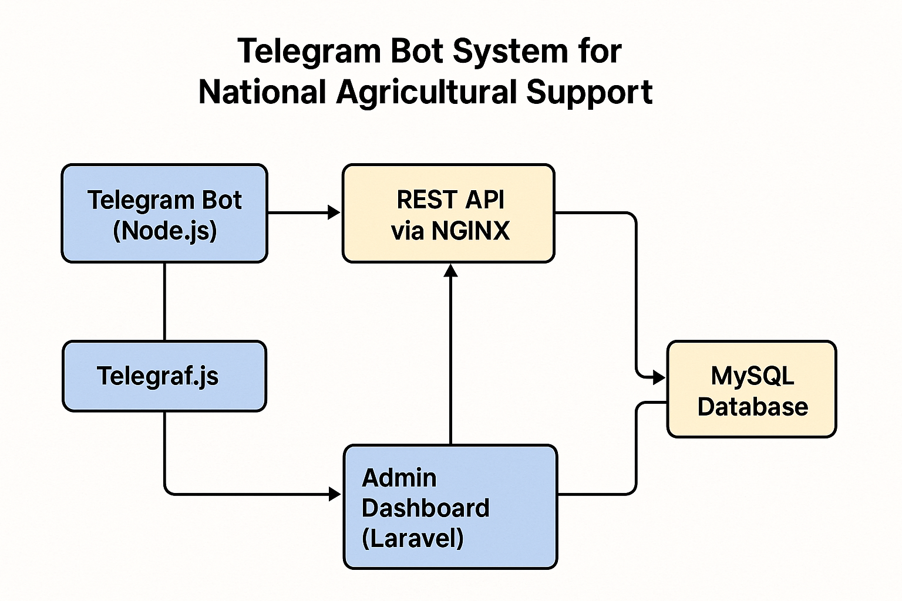

### 🧾 Case Study: Telegram Bot System for National Agricultural Support

**Project Name:** National Farmer Assistance Platform (Ukraine-wide)  
**Type:** Telegram bot + Admin Dashboard for agricultural logistics  
**Role:** Lead Full-Stack Developer

**Problem:**  
During a nationwide crisis, farmers across Ukraine needed a fast and intuitive way to request help with fertilizer and grain distribution. The challenge was to build a scalable, accessible system for submitting, managing, and tracking such requests — without requiring users to install apps or register via browser forms.

**Solution:**

I developed a robust Telegram-based request system integrated with a full-featured admin dashboard.

- **Telegram bot (Node.js, Telegraf.js)** handled user registration (license plates), application submission/editing, and file uploads (e.g. documents).
- **Admin dashboard (Laravel/PHP)** enabled 4 operators with different access roles to manage requests, verify data, print invoices and delivery slips, and provide live support.
- The bot and dashboard communicated via a **REST API** served through **NGINX** on localhost.
- All data stored in **MySQL**, structured for efficient filtering and reporting.
- **Deployed via PM2**, version-controlled via Git, with fully scripted startup/restart flow.

**Features:**

- Document upload by users
- Real-time request editing
- Role-based access in admin panel
- Generation and printing of invoices and delivery slips
- 2-way support flow via Telegram + admin backend

**Result:**

- Processed over **15,000 unique applications** in the first 2 months
- Averaged **~1000 applications per day** under full load
- Reduced request handling time by **3×** vs previous spreadsheet-based process
- Supported 4 administrators working in parallel with clear role separation

**Tech Stack:**  
Node.js, Telegraf.js, Laravel (PHP), MySQL, REST API, NGINX, PM2, Git

**Repository:** _Private / Not Public due to NDA_
